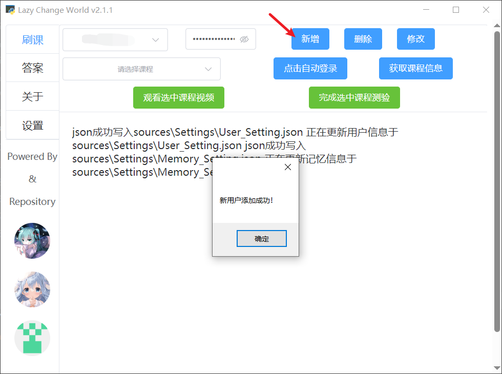
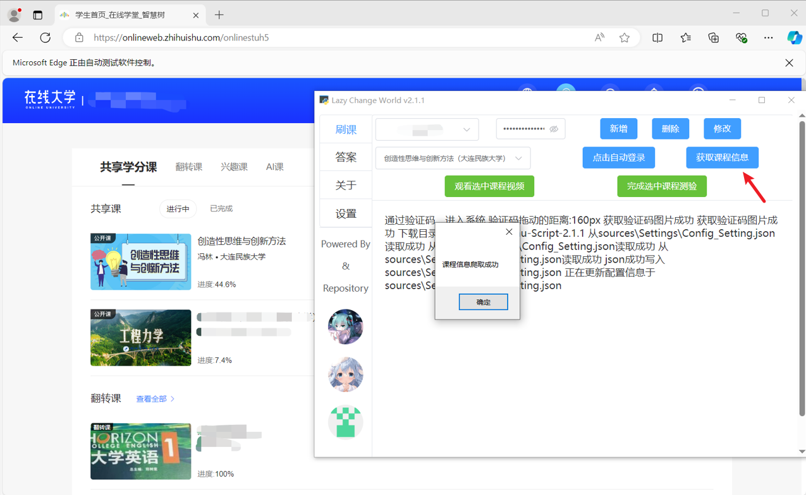
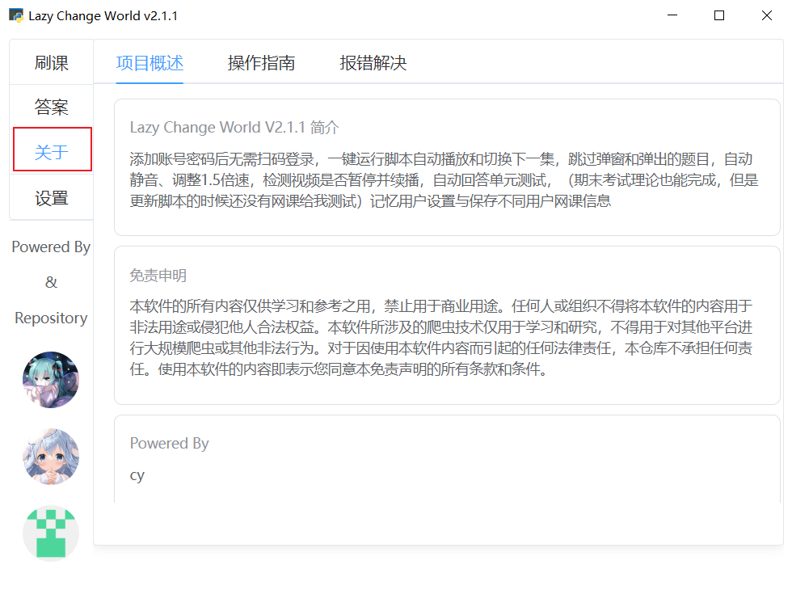
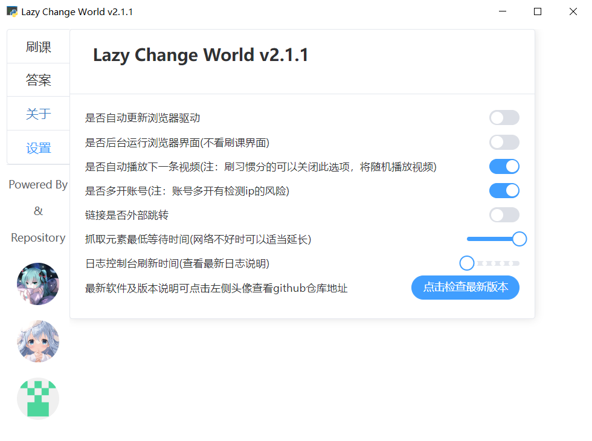

## 智慧树脚本Lazy Change World V2.1.1基本使用说明

智慧树（知到）自动刷课+自动答题脚本，开启挂机摸鱼时代~

**新学期必备干货, 建议收藏备用 !!**

**Github项目主页：**[666cy666/Script-Zhihuishu: 智慧树脚本，自动化刷课，自动化回答章节测试，自动答题 (github.com)](https://github.com/666cy666/Script-Zhihuishu)

------

#### 2024/10/8 update-2.1.1大更新

- 更新gui，**船新ui**采用pywebview与vue交互，看着顺眼多了
- 更新答题抓取算法与题库匹配算法，避免旧版本因无法抓取题目文本无法适配题库跳过答题的情况
- 更新老版本无法解决的异地登录与休眠验证的**验证码**处理而导致程序中断的问题
- 增加个性化选项设置如**习惯分**、**多开账号**、**版本检测**更新等选项
- 增加**关于**选项，用户可点击相关问题链接查找对应解决方法
- 修复了旧版本存在的selenium等待抓取元素超时报错闪退的问题

**后续v-3.1.0更新计划**（12月中旬左右）

- 更新多线程架构，减少线程通信之间的报错
- 将selenium架构替换为drissionpage库
- 优化题目爬取算法与检测异地登录算法，减少打包体积（尽可能不引入torch）
- 优化ui

------

#### 一、程序介绍

**项目简介**

这是一个点一个按钮就能解放双手双脚的自动化程序，和软件的名字一样（**Lazy Change World**）非常适合懒得找脚本配置的大学生（你问为什么是大学生？废话只有大学牲才要看网课），基于**PyWebview**桌面程序开发与**Selenium**自动化框架完成，由Vue与Python编写而成；核心原理是使浏览器模拟用户的点击操作。相对于常见的油猴脚本，本程序可有效防止被网页检测（电子生命也是生命！），同时友好的ui交互界面非常好上手。

**程序功能:**

|          功能          |     1.x     |                 2.x                 |
| :--------------------: | :---------: | :---------------------------------: |
|        GUI界面         | ✅古老且简朴 | ✅html界面与python交互，美观且易上手 |
|        自动登录        |      ✅      |    ✅优化旧版登录失败无后续的问题    |
|        自动刷课        |      ✅      |                  ✅                  |
|    自动回答单元测试    |      ✅      |      ✅（更新算法，更快更精准）      |
|        刷习惯分        |      ❌      |                  ✅                  |
| 检测刷课过程中的验证码 |      ❌      | ✅(减少刷一半课被验证码打断的可能性) |
|        无头模式        |      ❌      |                  ✅                  |
|      记忆用户设置      |      ❌      |                  ✅                  |
|    检测版本更新情况    |      ❌      |                  ✅                  |

------

#### 二、使用须知

1.请确保系统为windows10及以上

2.由于该程序依赖selenium执行，因此确保第一次在设置中将`是否自动更新浏览器驱动`选项勾上（在设置中第一次运行默认下载更新驱动，该配置将自动为用户下载适配的edge浏览器驱动）

3.该程序爬取答案时受来源网址影响，暂时无法获取题库信息，对于来源网址（来源网址详细查看[五、叠甲声明](#五叠甲声明)）没有相应网课的答案无能为力（后续开发会考虑爬取题库或者接入api，各位大佬饶我一条小命:sob::sob::sob:）

4.运行 **Lazy Change World.exe**，在[关于](#关于)模块中会有各种说明，请仔细查看。

------

#### 三、快速上手

##### 刷课&答题

先点击上方新增按钮，添加需要刷课的用户信息，随后点击自动登录

登录后点击`获取课程信息`按钮，待爬取完成后可以点击下方的观看选中课程及答题

刷课过程

在当前页面或登录后页面点击`完成选中课程测验`，系统将自动匹配答案辅助答题

##### 关于

在关于界面中可查看最新更新的详细说明以及报错解决

##### 设置

自定义设置，设置说明：

|          设置          |     默认      |                             说明                             |
| :--------------------: | :-----------: | :----------------------------------------------------------: |
| 是否自动更新浏览器驱动 | ✅（首次启动） |        系统将自动更新适配当前操作系统的edge浏览器版本        |
| 是否后台运行浏览器界面 |       ❌       | 开启后系统将没有浏览器界面，只能通过控制台输出的日志查看情况，刷课的时候可以打开，答题的时候建议关闭 |
| 是否自动播放下一条视频 |       ✅       | 刷习惯分时可以关闭此选项，关闭后系统将自动刷30分钟左右的未观看课程 |
|      是否多开账号      |       ❌       | 本程序可多开账号，但系统只对最后一个打开的账号有操作权限（智慧树后台有几率检测ip，谨慎使用） |
|    链接是否外部跳转    |       ❌       |    开启该选项可在线查看最新报错说明，关闭后为复制链接地址    |
|  抓取元素最低等待时间  |      5s       |    系统检测单个网页元素的默认时间(网络不好时可以适当延长)    |
|   日志控制台刷新时间   |     0.5s      |                        刷新日志的时间                        |
|    点击检查最新版本    |       /       | 最新软件及版本说明，若检测到最新版本，可点击左侧头像查看github仓库地址下载最新release |

- 若出现其他异常崩溃，请提交issue并附上日志文件log/log.txt的信息，三个臭皮匠将第一时间（bushi）回复并在`关于`中增加相关说明

------

#### 四、发行版下载

**注意：本程序只可用于学习和研究计算机原理**

Github: [Release Lazy Change World V2.1.1 · 666cy666/Script-Zhihuishu-Code (github.com)](https://github.com/666cy666/Script-Zhihuishu-Code/releases/tag/V2.1.1)

**源代码**请自行前往Github项目主页下载（`开源ChangeWorld!`）

------

#### 五、叠甲声明 

> 大家请以学习为目的使用本仓库，爬虫违法违规的案件：https://github.com/HiddenStrawberry/Crawler_Illegal_Cases_In_China
>
> 本仓库的所有内容仅供学习和参考之用，禁止用于商业用途。任何人或组织不得将本仓库的内容用于非法用途或侵犯他人合法权益。本仓库所涉及的爬虫技术仅用于学习和研究，不得用于对其他平台进行大规模爬虫或其他非法行为。对于因使用本仓库内容而引起的任何法律责任，本仓库不承担任何责任。使用本仓库的内容即表示您同意本免责声明的所有条款和条件。

感谢以下答案网址来源的贡献：

[果果课|智慧树知到章节测试答案 (iamooc.com)](http://www.iamooc.com/zhihuishudaan.htm)

#### 六、相关技术

##### 杂谈

本来v1.x版本是鄙人的python大作业，当时想上传github玩玩，上传了github后，没想到还真的有几颗星星，还有几个小伙伴加了我一起讨论了刷课的技术（天下苦网课久矣），在沉淀了一年之后回头来看这代码真是:poop:山，同时暑假又有了几个小伙伴加我问怎么失效了，于是便有了重构的想法，一路上遇到了不少的坑，吭哧吭哧，磕磕绊绊最后还是勉强完成了更新，python端我觉得一开始写的还好，后面加了杂七杂八的选项之后就开始崩坏了（论:poop:山是怎么形成的）——至于前端，呵，我不会承认这是我写的，一开始说是用vue脚手架写，但是pywebview加载的是html文件，不好调试，只能采用vue的网页版，当时想的是顶多四个界面，我甚至不用加路由，最后在一个html下写了600多行:laughing::laughing::laughing:

##### 后续更新

之前也接触过playweight，drissionpage等框架，但是:poop:山已经搭成了，箭既已在弦上 吾又岂能不发！！！后续的话会将selenium框架改为drissionpage，这个框架和selenium差不多，但是它比selenium牛逼的是能抓取shadow-root(closed)

##### v2.x的技术迭代

在v1.x版本中还留了很多历史遗留问题，大的问题就三个，其他的细节问题很多就不赘述了,踩了不少坑，感觉启发还是很大的，也希望能给后来的人一点启发。

1.刷课时会有验证出现导致刷课中断，只能手动点击重新启动，v2.x采用了多线程不断检测验证码是否出现，再用opencv+ddddocr识别验证。
相关文档：[基于PyWebview与Selenium的智慧树脚本系统踩坑开发日志（五）—— 基于opencv与dddocr的验证码匹配算法 | cy’s Blog (666cy666.top)](https://666cy666.top/2024/10/09/24-10-09-基于PyWebview与Selenium的智慧树脚本系统踩坑开发日志（五）——基于opencv与dddocr的验证码匹配算法/)

2.shadow-root反爬技术导致答题时无法抓取题目，v1.x的时候为了解决这个问题（没有解决）直接匹配数据库中的答案是第几章节第几题，这个就很靠爬取算法和格式化答案算法，中间少个答案就得寄。v2.x的时候采用cnocr识别selenium截图得到的题目，cnocr对于这种非常标准的网页文本格式识别非常精准。
相关文档：[基于PyWebview与Selenium的智慧树脚本系统踩坑开发日志（二）—— 解决shadow-root反爬 | cy’s Blog (666cy666.top)](https://666cy666.top/2024/09/25/24-09-25-基于PyWebview与Selenium的智慧树脚本系统踩坑开发日志（二）——解决shadow-root反爬/)

3.上文提到v1.x时答案匹配时直接匹配数据库中的答案是第几章节第几题，v2.x采用TF-IDF-文本向量化算法切片，余弦相似度匹配算法匹配答案，这样将文本切片，可以找到一题的完整题目，对格式化答案要求没那么大。
相关文档：[基于PyWebview与Selenium的智慧树脚本系统踩坑开发日志（三）—— 基于TF-IDF与文本向量化的答案匹配算法 | cy’s Blog (666cy666.top)](https://666cy666.top/2024/09/25/24-09-25-基于PyWebview与Selenium的智慧树脚本系统踩坑开发日志（三）——基于TF-IDF与文本向量化的答案匹配算法/)

-------
